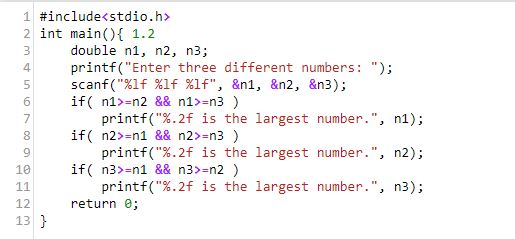
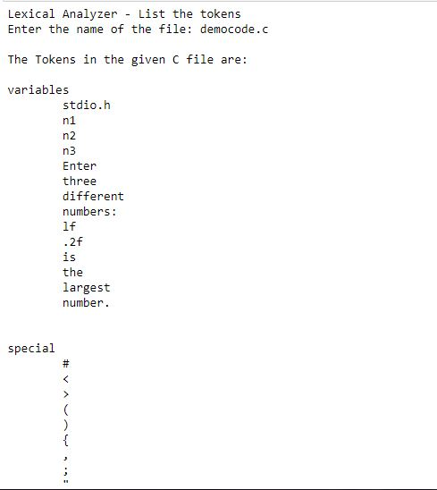
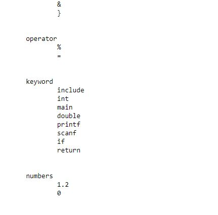

# Lexical Analyser

This python script finds out the tokens within a C code and then categorizes them in 4 different categories:
 
  1.Keywords  
  2.Numbers  
  3.Special Characters  
  4.Operators  
  
**Keywords** are the words specified in the keyword.txt file.

**Numbers** are numeric values in th program.

**Special Characters** refers to the terminators for tokens, as present in specialchar.txt file.

**Operators** refer to the general math operators as specified in operator.txt file.

Democode.c file contains the test code used. The program however asks for the file name, so other files can also be input to the program.

## Note:
The script only finds all the tokens as per the list of keywords, special characters and operators. It does not verify whether the program is correct. The analysing part is yet to be implemented and shall be uploaded soon.

## Test Code:

## Output:

